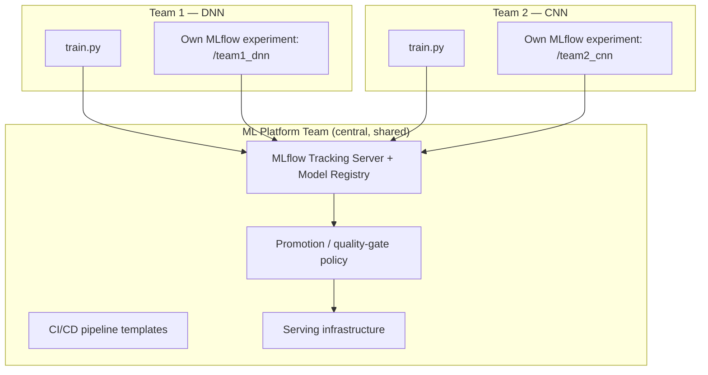
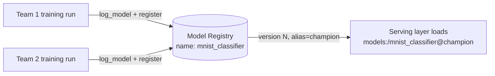
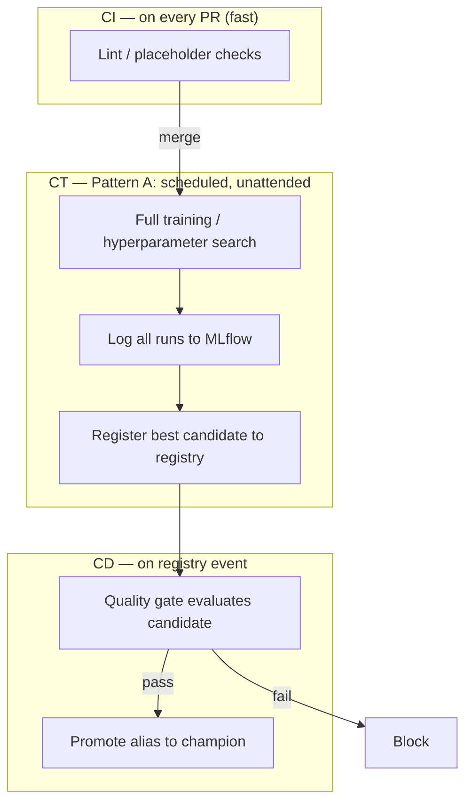
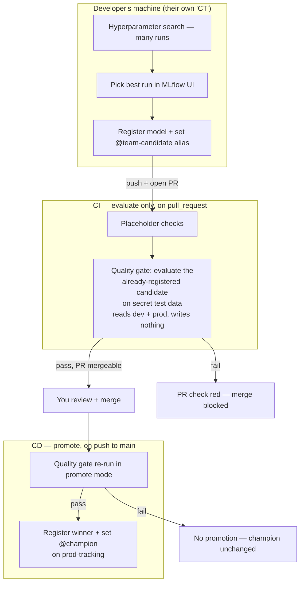
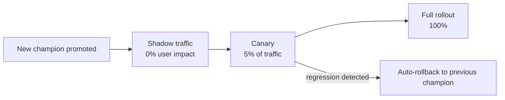
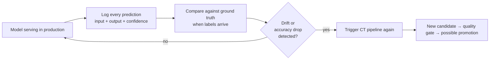

# How Real Companies Structure MLflow + CI/CD for ML Teams

This document explains the **structure** (not the code) of how a production ML platform
is organized inside a company that takes MLOps seriously — the kind of setup you'd find
at Google, a well-run mid-size tech company, or any org with a dedicated ML platform team.

The running example throughout is our own project: **two teams (DNN, CNN) training on
MNIST, competing for the same production model slot**, tracked with MLflow, shipped
through GitHub Actions. Wherever it helps, each section maps the real-world pattern back
to our situation.

---

## Table of Contents
1. [The Core Principle: Platform vs. Product Teams](#1-the-core-principle-platform-vs-product-teams)
2. [Org Structure — Who Owns What](#2-org-structure--who-owns-what)
3. [MLflow Topology in a Real Company](#3-mlflow-topology-in-a-real-company)
4. [Repository Structure](#4-repository-structure)
5. [CI, CT, and CD — Two Ways CT Can Work](#5-ci-ct-and-cd--two-ways-ct-can-work)
6. [Developer Walkthrough: A Day in Team 1](#6-developer-walkthrough-a-day-in-team-1)
7. [Quality Gates & Promotion Governance](#7-quality-gates--promotion-governance)
8. [Multiple Teams Competing for One Model Slot](#8-multiple-teams-competing-for-one-model-slot)
9. [Secrets & Config Management](#9-secrets--config-management)
10. [Reproducibility & Environment Pinning](#10-reproducibility--environment-pinning)
11. [Monitoring & the Feedback Loop](#11-monitoring--the-feedback-loop)
12. [Mapping This to Our Free-Tier Project](#12-mapping-this-to-our-free-tier-project)

---

## 1. The Core Principle: Platform vs. Product Teams

The single biggest structural fact about MLOps at a real company: **the people who train
models almost never own the infrastructure that tracks, tests, or deploys them.**

Two distinct groups exist:

| Group | Owns | Cares about |
|---|---|---|
| **ML / Data Science teams** (our Team 1 – DNN, Team 2 – CNN) | Model architecture, feature engineering, training code, hyperparameters | Accuracy, val loss, experiment velocity |
| **ML Platform / MLOps team** | Tracking server, CI/CD pipeline templates, model registry rules, serving infra, monitoring | Reproducibility, governance, uptime, cost, security |

Model teams are **consumers** of a "paved road" the platform team built once. They don't
configure MLflow servers, write GitHub Actions from scratch, or decide promotion rules —
they just call `mlflow.log_metric(...)` and open a PR. This is why, in a real org, DNN
and CNN teams would have **near-identical `train.py` structures** and would never touch
`.github/workflows/` or the registry-promotion logic themselves — that's platform-owned,
shared, reviewed-once code.

**Why it's structured this way:** if every team invents its own tracking setup and
promotion logic, you get N incompatible pipelines, N ways to leak secrets, and no way to
compare Team 1's model against Team 2's model on equal footing. Centralizing the
infrastructure is what makes the "competition for one production slot" (see §7) even
possible.

---

## 2. Org Structure — Who Owns What



Key structural rules this implies:

- **One tracking server for the whole org** (or business unit), not one per team. Teams
  get isolated **experiments** inside it, not isolated servers.
- **CI/CD templates are written once** by the platform team and reused (via reusable
  workflows / composite actions) by every model team, parameterized by folder path or
  experiment name.
- **Promotion policy is centralized code**, reviewed like any critical system — model
  teams cannot edit the rules that decide whether their own model ships.
- Model teams typically **cannot write directly to the "Production" registry stage**.
  Only the CI/CD service account can, and only after the quality gate passes.

---

## 3. MLflow Topology in a Real Company

### One logical tracking server, not "one per environment"

A common misconception is that you need a separate MLflow *server* for dev vs. prod.
In practice, most companies run **one MLflow tracking server (or a managed equivalent
like Databricks Managed MLflow / SageMaker Experiments / Vertex AI Experiments)** and
separate dev from prod using:

1. **Experiment naming/namespacing** — `/team1_dnn/dev`, `/team1_dnn/ci`, not different
   hosts.
2. **The Model Registry's stage/alias system** — `None → Staging → Production →
   Archived`, or the newer alias system (`@champion`, `@challenger`).
3. **Access control (RBAC)** at the server level — developers can read/write experiments
   and register model *versions*, but only a CI service principal can move a version's
   alias to `production`.

Some regulated industries (finance, healthcare) *do* run physically separate tracking
servers per environment for audit isolation — but that's the exception driven by
compliance, not the default MLOps pattern.

### The Model Registry is the contract

The registry — not the tracking server — is the actual interface between "training" and
"serving":



Whatever training code produced the model, whichever team, whatever framework — the
serving layer only ever asks the registry for "the current champion of
`mnist_classifier`." This decoupling is what lets Team 1 (DNN) and Team 2 (CNN) compete
for the same slot without the serving code caring who won.

### Naming conventions matter

Real orgs enforce a naming scheme so hundreds of experiments stay navigable:

```
{business_unit}/{team}/{project}/{env}
e.g. vision/team1_dnn/mnist/dev
     vision/team1_dnn/mnist/ci
```

Registered model names are usually the **product concept**, not the team or algorithm —
`mnist_classifier`, not `team1_dnn_model` — because the business cares about "the digit
classifier," not which architecture is currently winning.

### Concretely, for us: two servers, split by role

We use the two DagsHub-hosted MLflow servers we already have — `mlops-dev-tracking` and
`mlops-prod-tracking` — as physically separate systems, not just two experiment folders
on one host. This is the "regulated industries run separate servers per environment"
exception from above, applied deliberately here because the servers already exist:

| Server | Experiment / registry content | Who writes to it |
|---|---|---|
| `mlops-dev-tracking` | `team1_dnn`, `team2_cnn` experiments (every hyperparameter-search run); `mnist_classifier` registry with `@team1-candidate` / `@team2-candidate` aliases | Each team, from their own laptop |
| `mlops-prod-tracking` | `mnist_classifier` registry's **official** history, `@champion` alias; `quality_gate_evaluations` experiment | CI only (never a developer directly) |

Both teams still register to the same model *name*, `mnist_classifier` — it just exists
as two separate registry instances, one per server: a "candidate" copy on dev-tracking
and the "champion" copy on prod-tracking. Promotion (§5–§6) is the act of copying a
winning version from dev-tracking's registry into prod-tracking's.

---

## 4. Repository Structure

Most companies use a **monorepo (or a small number of "platform + product" repos)** for
ML, not one repo per team. Reasoning: shared CI templates, shared libraries (data
loading, evaluation, promotion logic) need to be versioned and updated in one place.

```
repo-root/
├── platform/                     ← owned by ML Platform team
│   ├── ci_templates/              (reusable GitHub Actions workflows)
│   ├── mlflow_utils/              (shared logging/evaluation helpers)
│   └── promotion_policy/          (quality-gate + promotion logic)
│
├── models/
│   ├── team1_dnn/                 ← owned by Team 1
│   │   ├── train.py
│   │   └── requirements.txt
│   └── team2_cnn/                 ← owned by Team 2
│       ├── train.py
│       └── requirements.txt
│
├── serving/                      ← owned by Platform / Serving team
│   └── inference_service/
│
└── .github/workflows/             (thin workflows that call platform/ci_templates)
```

The important structural idea: **model teams' folders contain only what changes often**
(architecture, hyperparameters). Everything that must stay consistent across teams
(logging conventions, evaluation metric definitions, promotion thresholds) lives in a
shared, platform-owned location and is *imported*, not copy-pasted per team. Copy-pasted
pipeline logic across `team1_dnn/` and `team2_cnn/` is exactly the kind of drift real
companies try to avoid — if Team 1's quality gate and Team 2's quality gate can silently
diverge, the "competition" in §7 stops being fair.

---

## 5. CI, CT, and CD — Two Ways CT Can Work

"CT" (Continuous Training) is the step people usually assume means "retrain the model
inside the pipeline." That's true in *one* of two common patterns — not the only one, and
not the one we need.

### Pattern A — CT retrains from scratch, unattended

Used when retraining is **automatic and has no human curator**: a recommender system
retrained nightly on fresh data, a fraud model retrained weekly as new labeled cases come
in. Nobody is looking at a UI and picking a winning run — the pipeline must be trusted to
reproduce a good model from code + data alone, so it retrains for real, every time.



### Pattern B — CT is a human-curated candidate; CI only evaluates it

Used when a **developer already ran the hyperparameter search locally**, already picked a
winner by eye in the MLflow UI, and already registered that exact run's model artifact.
Nothing needs to be retrained — the artifact already exists and is already reproducible
(MLflow captured its code commit + environment when it was logged). CI's only job is to
**evaluate that specific registered version against unseen data and decide whether to
promote it.**



**This is the pattern we're using**, and it's the more common one for experiment-driven
teams iterating on a fixed dataset like MNIST — not a lesser version of Pattern A. Pattern
A tends to show up later, once retraining needs to happen on a schedule or trigger with no
human in the loop (e.g., because the underlying data keeps changing). Since MNIST doesn't
drift and a person is already choosing the winning hyperparameters, retraining inside CI
would just be redoing work that already happened, on the same data, for no new
information — Pattern B is the correct fit, not a simplification we're settling for.

The one thing worth keeping from Pattern A's philosophy: keep CI itself **fast**. Its job
here is placeholder checks (fine to leave trivial for now — a lint step or an import check
that always passes) plus the one thing that actually matters, the quality-gate
evaluation — not training.

**CI evaluates; CD promotes — these are not the same step.** The quality gate runs twice,
with different privileges. On `pull_request` it only reads (candidate from dev-tracking,
current champion from prod-tracking) and reports pass/fail as the PR's status check —
that's what blocks or allows merging. Only after you've reviewed and merged does the same
script run again, in promote mode, on `push` to `main` — that run is the only one allowed
to write a new version into prod-tracking's registry and move `@champion`. Re-running the
comparison at merge time (rather than trusting the PR-time result) also protects against
the champion having moved in the meantime — e.g. Team 2's PR merging first.

---

## 6. Developer Walkthrough: A Day in Team 1

Concretely, here's what a Team 1 (DNN) developer actually does, end to end:

1. **Pull `main`, branch off** — `feature/team1-tune-dropout`.
2. **Point local env at `mlops-dev-tracking`**, experiment set to `team1_dnn`.
3. **Run `train.py` locally.** It loops over the hyperparameter grid; every combination
   logs params + metrics only (cheap, no artifact yet) as its own MLflow run.
4. **Open the MLflow UI**, sort by `val_accuracy`, pick the winner. This is a human
   judgment call — nothing here is automated.
5. **The same script, for the winning run only**, now logs the full model artifact +
   `infer_signature`, and registers it — on **dev-tracking** — under the **shared**
   registered model name `mnist_classifier`, setting an alias like `@team1-candidate` —
   never `@champion`; that alias only exists on prod-tracking and is off-limits to
   developers.
6. **Commit + push, open a PR.** The diff is just code/config — no model files in git,
   the model already lives in the registry.
7. **CI fires** on the `pull_request` event, scoped to `team1_dnn/**`: a placeholder step
   that always passes for now, then the real step — the **quality-gate job, in evaluate
   mode**, pulls the candidate from dev-tracking by its alias, evaluates it against the
   secret test set (which the developer has never seen), and compares it against the
   current `@champion` read from **prod-tracking**. It only reads; it changes nothing.
   The result (pass/fail) becomes the PR's status check.
8. **You review the PR and merge it** — a genuinely human step; nothing is promoted yet,
   even if the check is green.
9. **Merging triggers CD**: the same quality-gate script runs again, now in **promote
   mode**, on the `push`-to-`main` event. It re-evaluates (in case the champion moved
   between approval and merge), and — only on pass — registers the winning version into
   **prod-tracking**'s `mnist_classifier` registry and moves `@champion` there. On fail,
   nothing is promoted; the merge itself is not undone.
10. **Whatever eventually serves the model** always resolves
    `models:/mnist_classifier@champion` on **prod-tracking** — it never needs to know
    whether Team 1's DNN or Team 2's CNN is currently winning.

---

## 7. Quality Gates & Promotion Governance

A "quality gate" is the automated judge that decides whether a newly trained model is
allowed to become the champion. Structurally, it always has the same four parts:

1. **A held-out evaluation set the model developer never saw** (our "secret test data"
   pattern) — prevents even unintentional overfitting to the metric everyone is
   optimizing against.
2. **A hard floor** (e.g. "must score ≥ 0.90 accuracy") — a bad model never ships, even if
   it happens to be the only candidate.
3. **A relative comparison against the current champion** — the candidate must beat, not
   just clear the floor, to actually be promoted. Ties usually favor the incumbent
   (stability bias).
4. **A promotion action restricted to a service identity** — a CI bot / service account
   moves the alias, never a human clicking "promote" in the UI, and never the model
   author. This is a governance control, not a technical one: it guarantees the same rule
   applied every time.

Many companies add a **human-in-the-loop approval step** on top of the automated gate for
high-stakes models (anything touching money, safety, or compliance) — the automated gate
narrows candidates down, a human still clicks "approve" in a PR-style review before
production traffic shifts. For something like MNIST digit classification the fully
automated gate is realistic; for a fraud model it typically wouldn't be.

Rollout itself is usually gradual, not a hard cutover:



---

## 8. Multiple Teams Competing for One Model Slot

This maps directly to our DNN vs. CNN setup, so it's worth stating explicitly how real
companies structure this so it stays a *fair, low-drama* competition rather than a
political fight:

- **One registered model name** (`mnist_classifier`) is the prize both teams target —
  never `team1_dnn_model` and `team2_cnn_model` as separate production artifacts, or
  there's nothing to actually compete over.
- **One shared evaluation dataset and one shared metric definition**, owned by the
  platform team, not by either model team — if Team 1 could pick their own test set,
  the comparison would be meaningless.
- **One shared promotion policy/script**, not one per team — this is the part we
  deliberately keep in a common location (not duplicated inside `team1_dnn/` and
  `team2_cnn/`) precisely so both teams are held to the identical bar.
- **The registry keeps full history** of every version from every team, so "who is
  currently winning and by how much" is always inspectable, and a regression can be
  traced back to a specific team's run.
- Companies often also require a **model card** (short doc: architecture, training data,
  known limitations, intended use) attached before a version is even eligible for
  promotion — this becomes more important as more teams/models compete for the same slot.

---

## 9. Secrets & Config Management

Structurally, secrets never live in application code or the repo, in any environment:

- Local dev: developer's own `.env` (git-ignored), pointing at *their* credentials for a
  dev-tier tracking experiment.
- CI/CD: secrets injected by the platform (GitHub Actions Secrets, or a dedicated vault
  like HashiCorp Vault / AWS Secrets Manager / GCP Secret Manager) as environment
  variables at job runtime — never checked into workflow YAML.
- Production credentials are scoped to a **service identity** distinct from any human
  developer's account, so access can be audited and revoked independently of who's
  currently on the team.

The `.env.example` pattern we already use (committed template, real `.env` git-ignored)
is exactly the structural pattern real companies use at the "one developer, one laptop"
layer — it just also gets layered with a proper secret manager once there's a shared CI
system and multiple environments involved.

---

## 10. Reproducibility & Environment Pinning

Three independent things must be pinned for a run to be reproducible months later, and
real companies track all three, not just the model file:

| What | How it's pinned | Where MLflow already helps |
|---|---|---|
| **Code** | Git commit SHA | MLflow auto-logs the git commit of the run |
| **Environment** | Container image / lockfile | MLflow auto-captures `conda.yaml` / `requirements.txt` / `python_env.yaml` alongside the model |
| **Data** | Dataset version/hash | Needs an explicit tool (DVC, lakeFS, or logging a dataset hash as an MLflow tag) — MLflow does not version raw data itself |

At larger companies, training itself typically runs inside a **container image built
once by the platform team** (same base image for every team) so "works on my machine"
differences can't creep into what CI or CT actually executes.

---

## 11. Monitoring & the Feedback Loop

Deploying isn't the end of the pipeline — it's what closes the loop back to CT:



The structural point: production monitoring isn't a separate concern bolted on at the
end — it's the thing that **re-triggers CT**, closing the loop so the system keeps
improving (or at least keeps noticing when it's degrading) without a human having to
remember to check.

---

## 12. Mapping This to Our Free-Tier Project

None of the above requires paid infrastructure to *learn* — only to run at real scale.
Here's the realistic mapping for a free-tier version of this same structure:

| Real-company piece | Our free-tier equivalent |
|---|---|
| Managed MLflow (Databricks/SageMaker) | Self-hosted MLflow tracking, or a free hosted tracking server (e.g. DagsHub) |
| RBAC-controlled tracking server | Two DagsHub servers (`mlops-dev-tracking`, `mlops-prod-tracking`) instead of one RBAC-partitioned server — separation by host, not by permission roles |
| Airflow / Kubeflow (CT orchestrator) | Scheduled or manually-triggered GitHub Actions job |
| Vault / cloud Secret Manager | GitHub Actions Secrets |
| Canary/shadow rollout infra | Skipped or simulated — straight promote/rollback for now |
| Dedicated serving infra + autoscaling | Free-tier container hosting (Render, Fly.io, HF Spaces) behind a simple FastAPI app |
| Data versioning tool (DVC/lakeFS) | Fixed dataset (MNIST) + logged split-seed/version as an MLflow tag |

The point of matching structure rather than tooling: when this project (or you,
professionally) moves to a real company's stack, the *shapes* — platform vs. product
team boundary, CI/CT/CD separation, registry as the training/serving contract, shared
quality gate for competing teams — transfer directly. Only the specific tool names
change.
