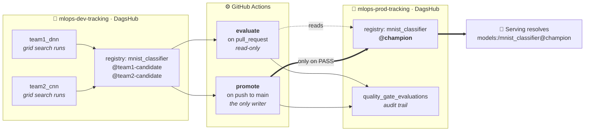
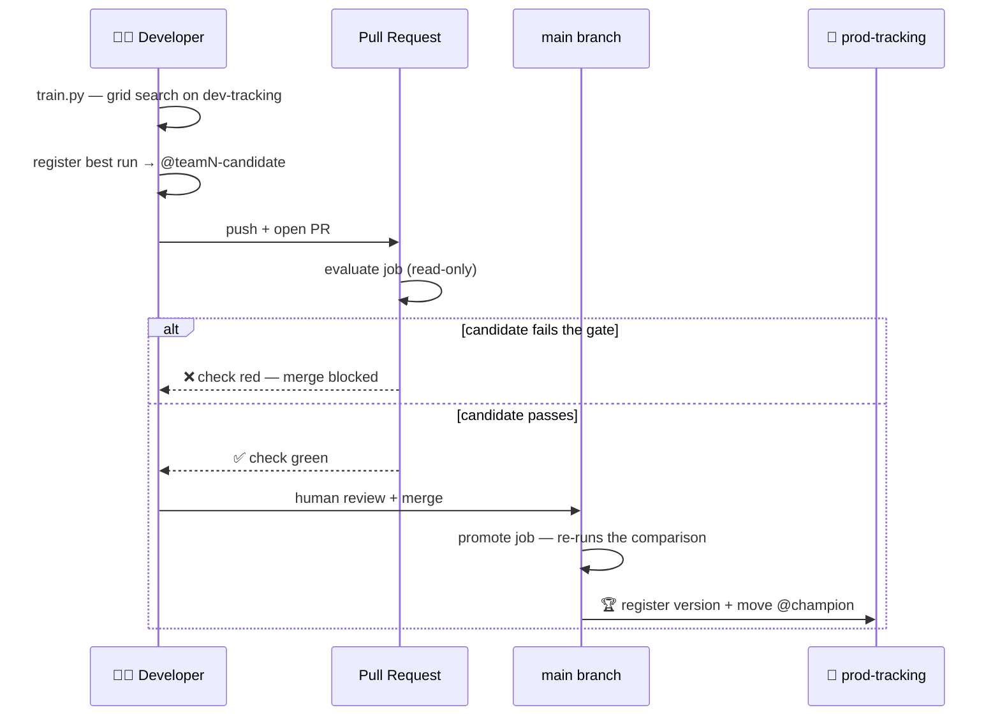

<div align="center">

# 🏆 MLDevOps — Two Teams, One Production Slot

**A working MLOps platform where two ML teams compete for the same production
model, and an automated quality gate — never a human — decides who ships.**

[](https://github.com/ErfanDejband/MLDevOps/actions/workflows/team1_dnn_quality_gate.yml)
[](https://github.com/ErfanDejband/MLDevOps/actions/workflows/team2_cnn_quality_gate.yml)


</div>

---

## The problem this solves

Most ML tutorials stop at "train a model and log it to MLflow." That leaves the
questions a real platform team actually has to answer:

- How do you stop a data scientist from pushing their own model straight to production?
- When two teams claim their model is better, **who decides**, and how do you keep it fair?
- A model regressed last Tuesday. Which code, which environment, and **which data** produced it?

This repo answers all three, end to end.

> **Team 1** trains a DNN. **Team 2** trains a CNN. Both register under the same
> model name, `mnist_classifier`. Only one holds the `@champion` alias at a
> time, and neither team can promote itself — a shared, versioned quality gate
> does that, applying an identical bar to both.

---

## Architecture at a glance



**Developers hold credentials for the dev server only.** The production
tracking server's credentials exist exclusively as GitHub Actions secrets, so
promoting your own model isn't merely discouraged — it's impossible.

---

## The quality gate

Every candidate must clear all three bars before it becomes champion:

| # | Rule | Why it exists |
|---|---|---|
| 1 | Score ≥ **0.90** accuracy on a secret held-out set | A bad model never ships, even as the only candidate |
| 2 | **Strictly beat** the current champion | Ties favour the incumbent — stability bias |
| 3 | Evaluated on data **no team has ever seen** | Prevents even unintentional overfitting to the metric |

Both teams are judged by the *same script* — [`CICD_MLops/shared/quality_gate.py`](CICD_MLops/shared/quality_gate.py).
There is deliberately no per-team copy, so the two gates cannot quietly diverge.

### CI evaluates, CD promotes



**Why re-run the comparison after merge?** The champion can move between when
your PR was approved and when it lands — if the other team merges first, you
must be compared against the *new* champion, not a stale one.

---

## Results

<!-- Replace the placeholder rows below with real numbers after each promotion. -->

### 🏅 Champion history

| Date | Team | Architecture | Secret-test accuracy | Version | Promoted by |
|---|---|---|---|---|---|
| _TBD_ | `team2_cnn` | Conv32→Pool→Conv64→Pool→Dense128 | `_0.____` | `v_` | CD run `#__` |
| _TBD_ | `team1_dnn` | Dense512→Dense256→Softmax10 | `_0.____` | `v_` | CD run `#__` |

### 📊 Head-to-head

| Metric | Team 1 — DNN | Team 2 — CNN |
|---|---|---|
| Best validation accuracy | `_0.____` | `_0.____` |
| Secret-test accuracy | `_0.____` | `_0.____` |
| Trainable parameters | `___` | `___` |
| Training time (grid search) | `___` | `___` |

### 🖼️ Screenshots

> Drop images into `docs/img/` and they will render here.

| | |
|---|---|
| **Experiment tracking** — grid search runs compared in the DagsHub MLflow UI<br/> | **Model registry** — version history and the live `@champion` alias<br/> |
| **Quality gate in CI** — the PR check that blocks a regression<br/> | **Confusion matrix** — champion model on the secret test set<br/> |

---

## Quick start

```bash
# 1. One environment for the whole repo, at the root
python -m venv .venv
.venv\Scripts\activate            # Windows
# source .venv/bin/activate       # macOS / Linux
pip install -r requirements-dev.txt

# 2. Point yourself at the dev tracking server
cp CICD_MLops/WIKI/.env.example CICD_MLops/team1_dnn/.env
#   …then fill in your mlops-dev-tracking DagsHub credentials

# 3. Train — grid search, then register the winner as your team's candidate
python CICD_MLops/team1_dnn/train.py

# 4. Dry-run the exact check your PR will get
python CICD_MLops/shared/quality_gate.py --mode evaluate --team team1_dnn
```

Then push and open a PR — the `evaluate` job becomes your status check, and
merging triggers `promote`.

---

## Repository layout

```
.
├── requirements.txt              Platform base — teams inherit this, never re-pin
├── requirements-dev.txt          Base + ruff/pytest for local work
│
├── CICD_MLops/
│   ├── shared/
│   │   └── quality_gate.py       ONE gate for both teams — the promotion rule
│   ├── team1_dnn/                Team 1's code — theirs to change freely
│   ├── team2_cnn/                Team 2's code — theirs to change freely
│   └── WIKI/
│       ├── ARCHITECTURE.md       How real companies structure this, and why
│       ├── plan_to_impliment.md  The build plan, decisions and trade-offs
│       └── .env.example          Credential template
│
└── .github/workflows/            evaluate (PR) + promote (merge) per team
```

**The boundary that matters:** team folders hold only what changes often
(architecture, hyperparameters). Everything that must stay identical across
teams — the gate, the metric definition, the promotion rule — lives in
`shared/`. Copy-pasted pipeline logic is exactly the drift this structure
prevents.

---

## Design decisions worth reading

The reasoning behind this setup is documented rather than assumed:

- **[`WIKI/ARCHITECTURE.md`](CICD_MLops/WIKI/ARCHITECTURE.md)** — how real ML platform
  teams organise this: platform vs. product ownership, MLflow topology, promotion
  governance, the reproducibility triangle, and what a free-tier version maps to.
- **[`WIKI/plan_to_impliment.md`](CICD_MLops/WIKI/plan_to_impliment.md)** — the
  implementation plan, including why CI and CD had to be split into separate jobs.
- **[`CICD_MLops/README.md`](CICD_MLops/README.md)** — the project's own deep dive.

---

## Roadmap

- [x] Two-server MLflow topology with alias-based promotion
- [x] Shared quality gate, wired into GitHub Actions
- [x] Consolidated environment + dependency inheritance
- [ ] **DVC data versioning on the DagsHub remote** — the missing reproducibility leg
- [ ] `dvc.yaml` pipeline stages: `prepare → train → evaluate` as a reproducible DAG
- [ ] Model card required before a version is promotion-eligible
- [ ] FastAPI serving stub resolving `models:/mnist_classifier@champion`
